# Visual Reference Gallery

Every major pattern in the app, captured as a reference for when you're asking Claude to build something "like that screen". Point at a pattern by its name or by the route — Claude will know what you mean.

Screenshots are captured from the live build. They will evolve as the design evolves.

---

## FileFlow Inbox — list + filter + group + table

The foundational data-grid pattern. Filter popover with categories, group-by collapsible sections, search, status pills.

**Route:** `/`
**File:** `src/components/fileflow-inbox.tsx`

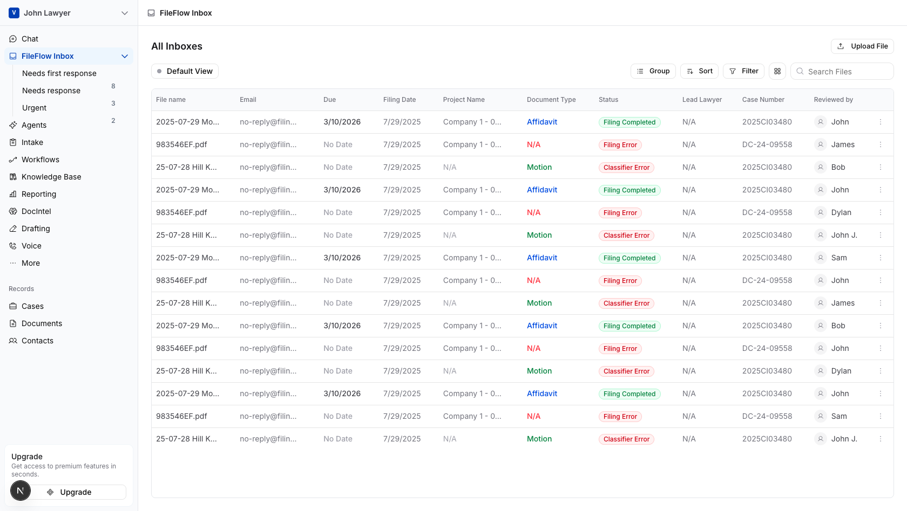

---

## File Detail View — tabs + content + sidebar cards

Detail pages with custom underline tabs, extracted data cards, AI chat input, and a right sidebar with filing + preview cards.

**Route:** `/fileflow-inbox/0`
**File:** `src/components/file-detail-view.tsx`

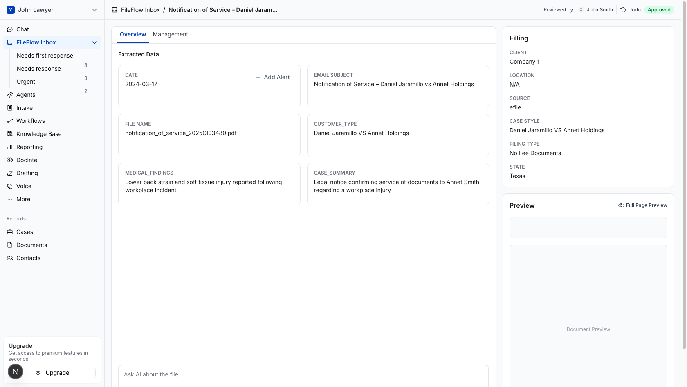

---

## Unified Runs Grid — "activity log" data table

Every run across every playbook in one grid. Playbook column identifies the type. Output cells render differently per playbook. Filter-by-playbook dropdown.

**Route:** `/workflows` (Runs tab)
**File:** `src/components/unified-runs.tsx`

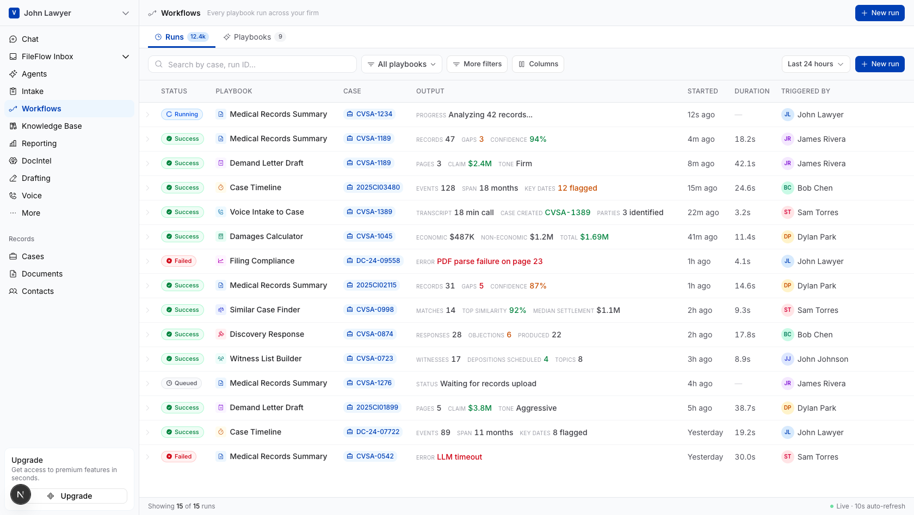

---

## Playbooks Library — card grid with featured + pinned sections

Card grid for browsing reusable AI procedures. Featured banner at top, pinned section, category tabs, trending badges, create card.

**Route:** `/workflows` (Playbooks tab)
**File:** `src/components/playbooks-library.tsx`

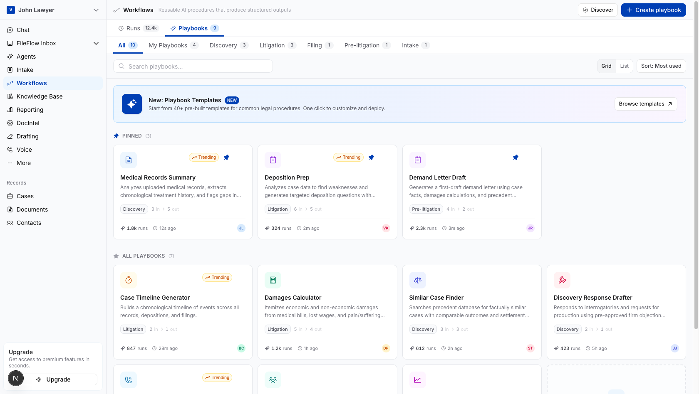

---

## Run Detail Drawer — right-side detail on row click

Click any row to slide in a drawer showing structured inputs, outputs (metrics + JSON), timeline, and a collapsible execution log. Footer actions.

**Route:** `/workflows` → click any row

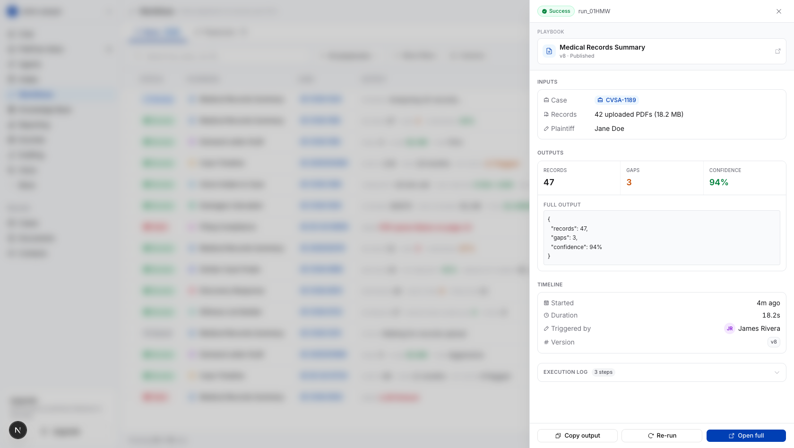

---

## Playbook Editor — Deposition Prep

Focused editor view with strong identity header. Definition panel on the left (inputs, steps, outputs), live test panel on the right. Step blocks are color-coded by type (Fetch / Prompt / Extract).

**Route:** `/workflows/depo-prep/edit`
**File:** `src/components/workflow-editor.tsx` + `src/components/workflow-builder.tsx`

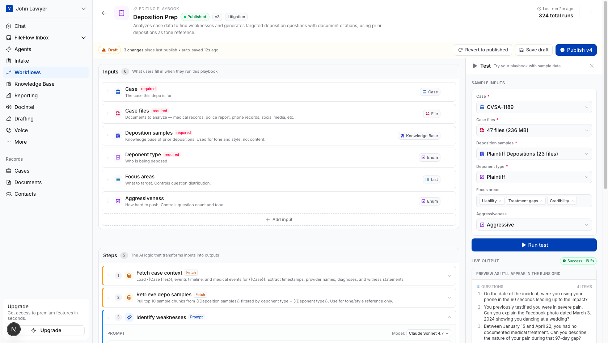

---

## Playbook Editor — Medical Records Summary

Simpler playbook editor showing the same pattern with fewer inputs/steps/outputs. Notice how Test panel renders outputs per-playbook type.

**Route:** `/workflows/medical-records-summary/edit`

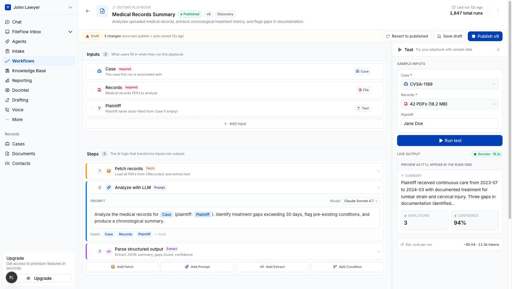

---

## Knowledge Base — list

AirOps-style library of reusable reference collections. Status pills (Ready / Indexing / Error), file count, size, "Used by" playbook tags.

**Route:** `/knowledge`
**File:** `src/components/knowledge-list.tsx`

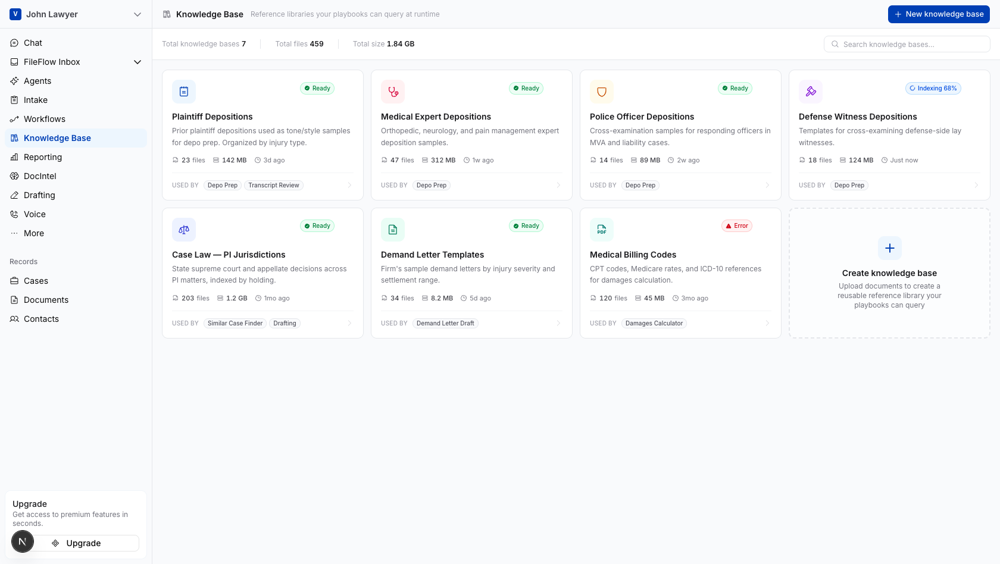

---

## Knowledge Base Detail — Files tab

Identity header + tabs (Files / Test & Search / Settings). Files tab has drag-and-drop upload zone and file table with indexing status.

**Route:** `/knowledge/plaintiff-depositions`
**File:** `src/components/knowledge-detail.tsx`

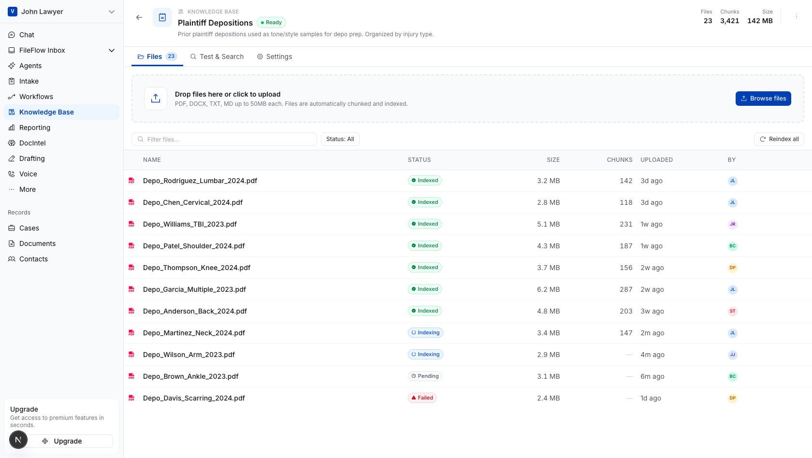

---

## Knowledge Base Detail — Test & Search tab

Live retrieval test — search input with top-N picker, model info, ranked results with file + page references and highlighted snippets.

**Route:** `/knowledge/plaintiff-depositions` → Test & Search tab

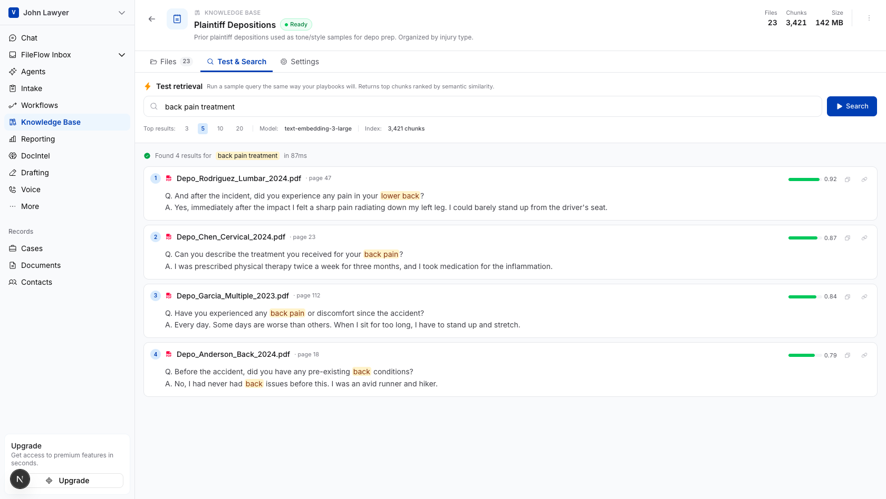

---

## Mockup: Magic Wand / Improve Prompt

Standalone sandbox page demonstrating a 3-state UI flow (empty → typed → improved). Good example of how to build a focused design exploration without the main app sidebar.

**Route:** `/mockups/magic-wand`
**File:** `src/app/mockups/magic-wand/page.tsx`

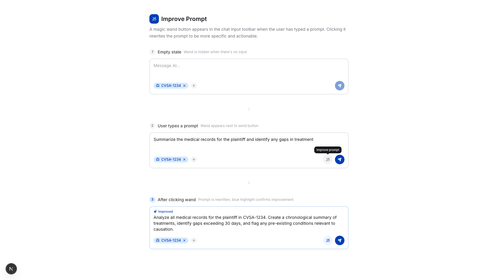

---

## Mockup: Playbooks Flow Explainer

Concept diagram page showing how Playbooks and Runs connect. Good template for explaining architectural concepts visually.

**Route:** `/mockups/playbooks-flow`
**File:** `src/app/mockups/playbooks-flow/page.tsx`

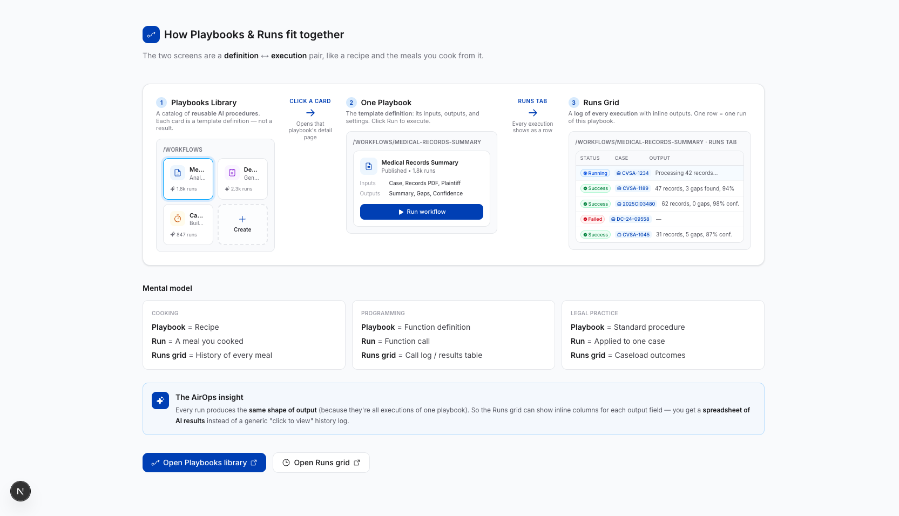

---

## Using this gallery with Claude

When you want a new screen, point at the closest pattern:

> "Build a new `/invoices` section. The list view should look like the **Knowledge Base list** (card grid with status). The detail view should look like the **Knowledge Base Detail** (tabs with Files, Test, Settings). See `REFERENCE.md` for both."

Claude will read this file, look at the referenced components, and build to match.
